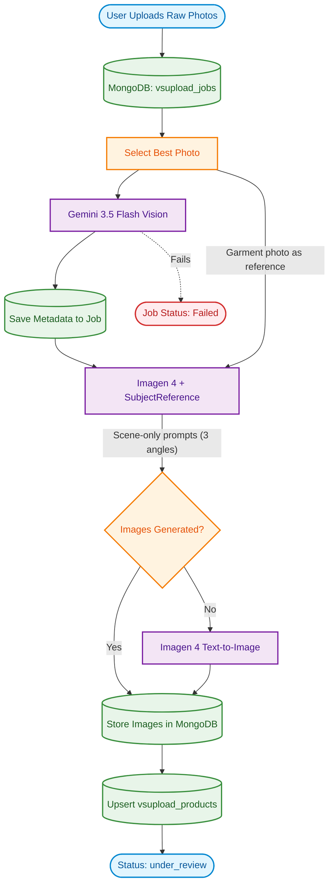

# Shree Ji E-Commerce - Virtual Styling Upload (VSUpload) Pipeline

## Reference-First Design

The pipeline is built on a core principle: **the garment photo IS the source of truth.**

Text prompts describe ONLY the scene, pose, and photography style — they never describe the garment itself. This prevents image generation models from overriding the actual garment with their internal biases (e.g., generating a saree when a suit was uploaded).

## How It Works

1. **Upload**: Users upload raw garment photos (suits, kurtis, lehengas, etc.).
2. **Metadata Extraction**: Gemini 3.5 Flash Vision extracts structured catalog data (`name`, `color`, `style`, `fabric`, etc.). This is used for the product listing — **not** for image generation.
3. **Primary Image Generation (Reference-First)**:
   - The uploaded garment photo is passed to Imagen 4 as a `SubjectReferenceImage`.
   - The text prompt describes ONLY the scene: "Professional e-commerce catalog photo, front-facing pose, clean white studio background..."
   - The reference image carries the garment identity — Imagen reproduces the exact clothing.
4. **Fallback Generation**: If the reference-based flow fails, the pipeline builds simple text prompts from the metadata and uses Imagen 4 in text-to-image mode.
5. **Database Storage**: Generated model images + extracted metadata are compiled into a product record with `under_review` status for admin approval.

## Why Reference-First?

| Old Approach (Text-Heavy) | New Approach (Reference-First) |
|---|---|
| Prompt: "A maroon salwar suit with golden embroidery..." | Prompt: "Professional catalog photo, front-facing pose..." |
| Imagen ignores text, generates a saree | Imagen sees the actual garment photo, reproduces it |
| Garment identity depends on text accuracy | Garment identity comes from the photo itself |
| Vision model errors cascade to image gen | Metadata errors only affect catalog, not the image |
