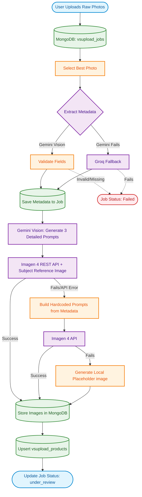

# Shree Ji E-Commerce - Virtual Styling Upload (VSUpload) Pipeline

This diagram explains the complete backend pipeline for processing raw garment photos and automatically generating AI model mockups and product metadata.

## Pipeline Overview

1. **Upload**: Users upload raw photos of garments (like suits, kurtis, lehengas).
2. **Metadata Extraction**: Gemini Vision acts as a fashion cataloguing expert to extract structured data (`name`, `description`, `color`, `style`, `fabric`, etc.). A text-only Groq fallback is used if Gemini is unavailable.
3. **Advanced Image Generation**: 
   - Gemini Vision analyzes the photo again to write 3 extremely detailed, photorealistic prompts (front, 3-quarter, and back views).
   - These prompts, along with the original photo (as a `SubjectReference`), are sent to the Imagen 4 Developer API to generate high-accuracy model catalog photos.
4. **Fallback Generation**: If the advanced reference image flow is restricted or fails, the pipeline falls back to generating standard prompts from the metadata and using Imagen 4 in text-to-image mode.
5. **Database Storage**: The generated model images and the extracted metadata are compiled into a product record and placed in an `under_review` state for the admin to approve.
